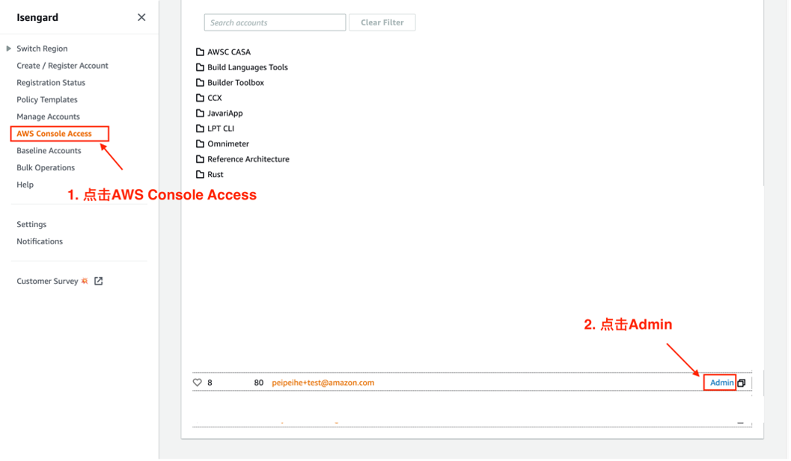
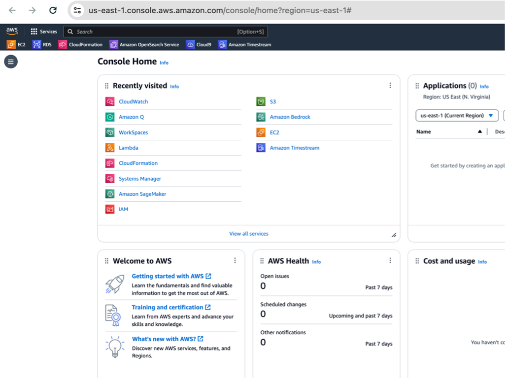
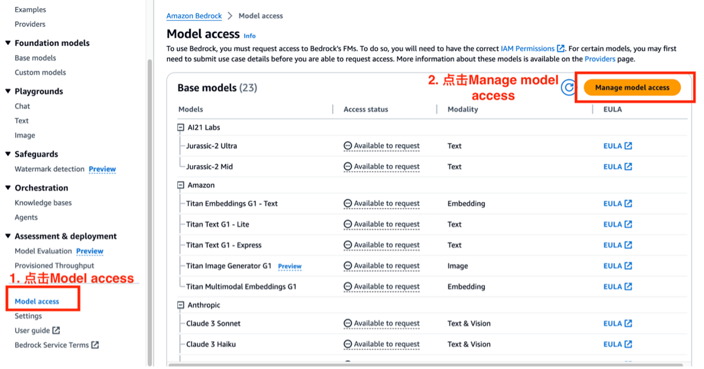
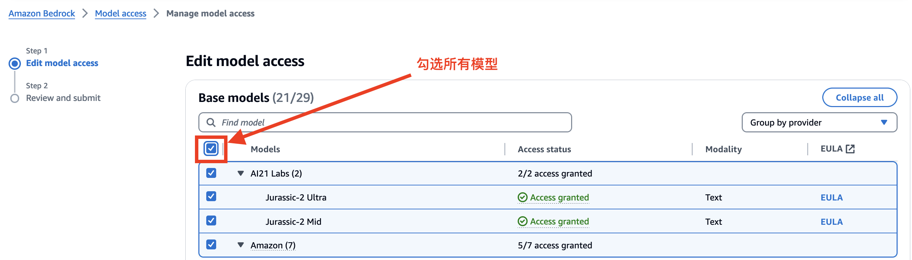

# 配置 Bedrcok 模型访问权限

1. 访问 [Link](https://isengard.amazon.com/console-access) ，点击左侧导航栏的 AWS Console Access，点击您的账号右侧 Admin 选项，稍等⽚刻界⾯会⾃动跳转 到 AWS 控制台（如第⼆张图所示）
   

   

2. 在 AWS 控制台顶部搜索栏搜索 Bedrock，在搜索结果中点击 Bedrock
   

3. 在右上角选择区域，请选择 US East (N.Virginia)，然后点击左侧 Bedrock 配置按钮，如下图所示

   

4. 在 Bedrock 左侧导航栏中，点击 Model access，然后点击 Manage model access
   

5. 如下图所示，在 Request model access 界面，勾选所有模型，然后点击右下角的 Request model access 按钮
   

6. 模型申请成功后您会看到所有模型 Access status 显示 access granted，如下图所示
   
7. 现在您可以和 Claude3 对话，如下图所示

- 点击左侧导航栏的 Playgrounds -> Chat
- 在 Chat playground 点击 Select model
- 选择 Anthropic
- 选择 Claude 3 Sonent
- 点击 Apply
- 之后您可以在对话框输入任何文字来和 Claude3 交流
  
  
