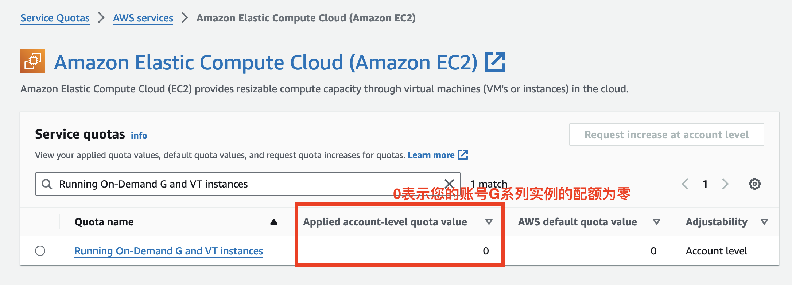
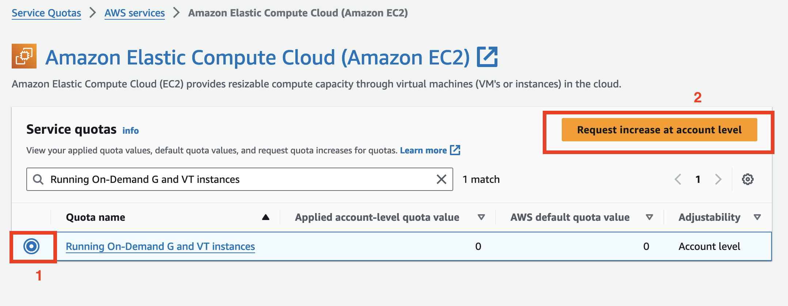
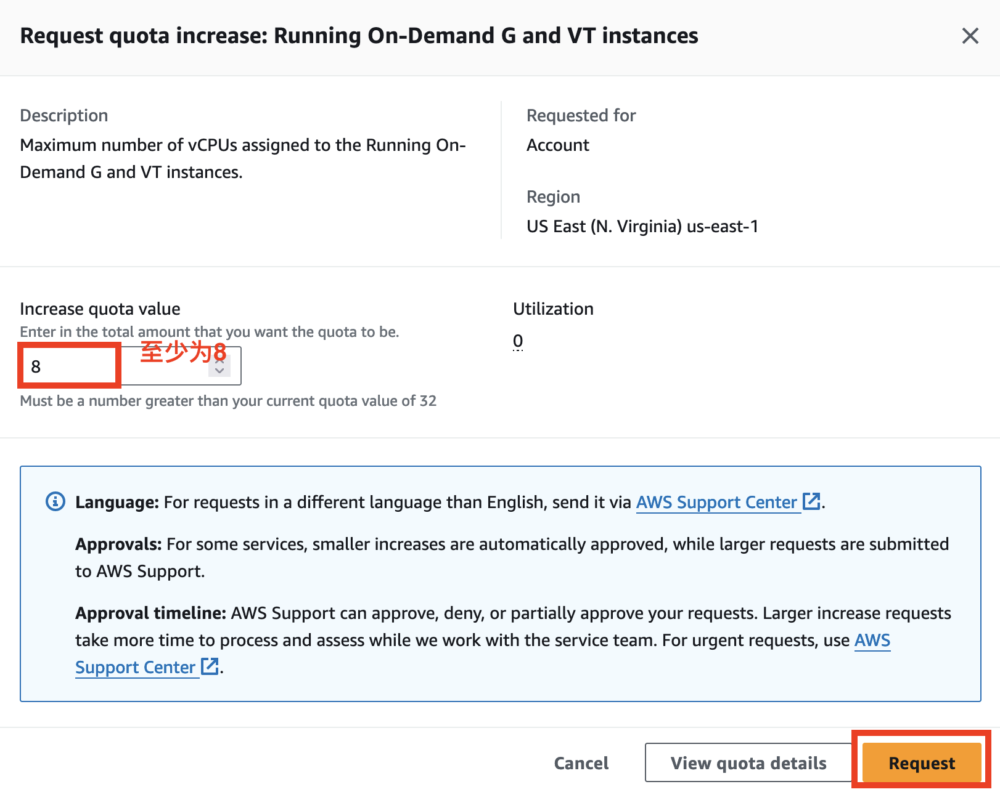
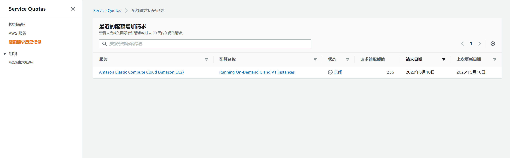
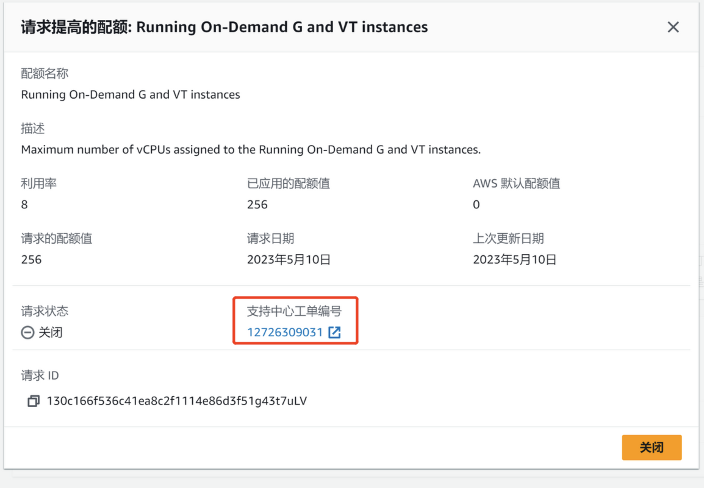
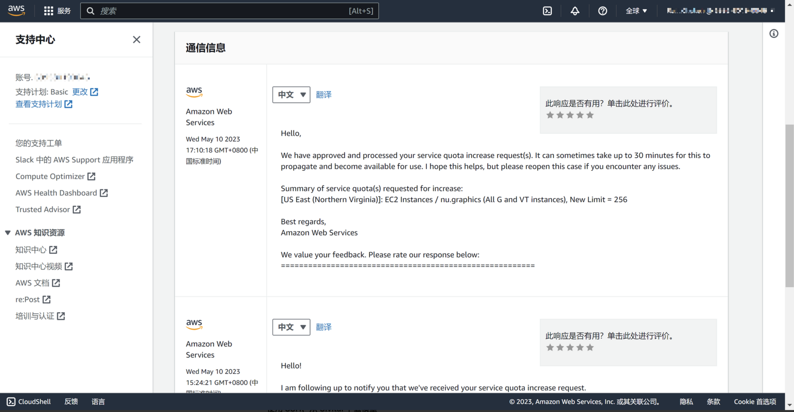

# 申请 G 系列实例限额

本次动手训练营将在美国东部 (弗吉尼亚北部) us-east-1 区域中完成，需要 EC2 加速计算型实例 g4dn.2xlarge 或 g5.2xlarge，请至少提前一周完成申请。

## 1. 在 Service Quota 服务进行申请

1. 请点击链接：https://us-east-1.console.aws.amazon.com/servicequotas/home/services/ec2/quotas?region=us-east-1
2. 如下图，在搜索框中输入 Running On-Demand G and VT instances。若第二列已应用的配额值小于 8，请按照以下步骤进行申请。若该值大于 8 表明您有足够的限额完成后续实验，可直接开始实验。
   

3. 选中需要提升配额的选项，选择“请求在账户级别增加”
   

4. 申请配额提升，至少为 8，然后点击橙色”请求“按钮提交。
   

5. 请求完成后，您可以点击左侧”配额请求历史记录”，可以在此处看到提交的请求历史和状态。
   

6. 点击请求的状态，可以看到一个纯数字的工单编号，点击该编号，会跳转到工单的通信界面，如果您的配额请求遇到问题，可以在此处和亚马逊云的后台支持工程师取得联系。
   
   
