# （可选）订阅和部署 ECR 文生图解决方案

imAgine 绘图解决方案已经登陆亚马逊云科技 Marketplace，您可以通过订阅解决方案来进行快速体验。

1. 点击以下链接快速进入亚马逊云科技控制台：https://us-east-1.console.aws.amazon.com/console/home?region=us-east-1

2. 在控制台右上角确认您当前所在的区域为美国东部 (弗吉尼亚北部) us-east-1，否则请切换。
   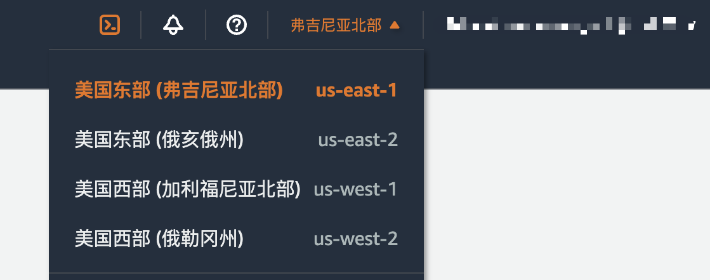

3. 请点击 [Marketplace 链接](https://aws.amazon.com/marketplace/pp/prodview-ohjyijddo2gka) ，进入 Marketplace 产品页面完成订阅流程。

   点击右上角橙色按钮 Continue to Subscribe，您将在此处完成产品条款、使用条件和软件服务费的确认。
   

   确认产品条款、使用条件和软件服务费的无误后，点击 “Accept Terms”。(注：文中的订阅链接为免费版 AMI 产品，除 EC2、EBS 等正常的 AWS 服务使用费，不会产生额外费用）
   

   您需要在此页面进行等待，显示 “Pending” 则代表订阅还在验证中。
   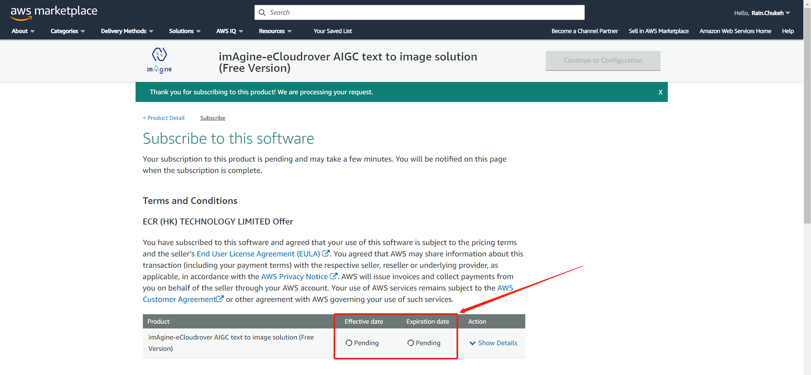

   大概需要数分钟来确认您的订阅，页面下方会展示订阅的有效期。到此为止，订阅流程已完成。随后您将进行解决方案的部署。

4. 当界面下方显示具体日期后，即可使用该订阅包含的 AMI，点击右上角 “Continue to Configuration” 继续下一步
   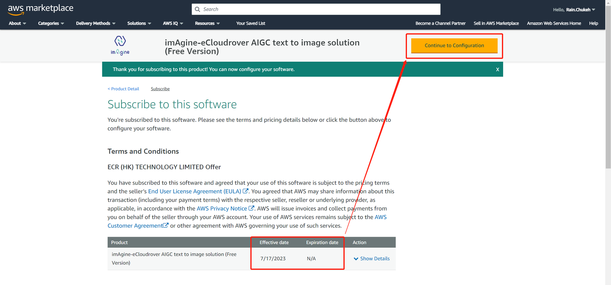

   **Software version**: 请选择专为本次动手训练营准备的 imAgine-Workshop-and-Blog-20240115，在该版本中，为您预装了本 workshop 所需的模型，以及常用的模型管理插件，历史图片浏览插件等。

   **Region**: 选择 美国东部 (弗吉尼亚北部) us-east-1
   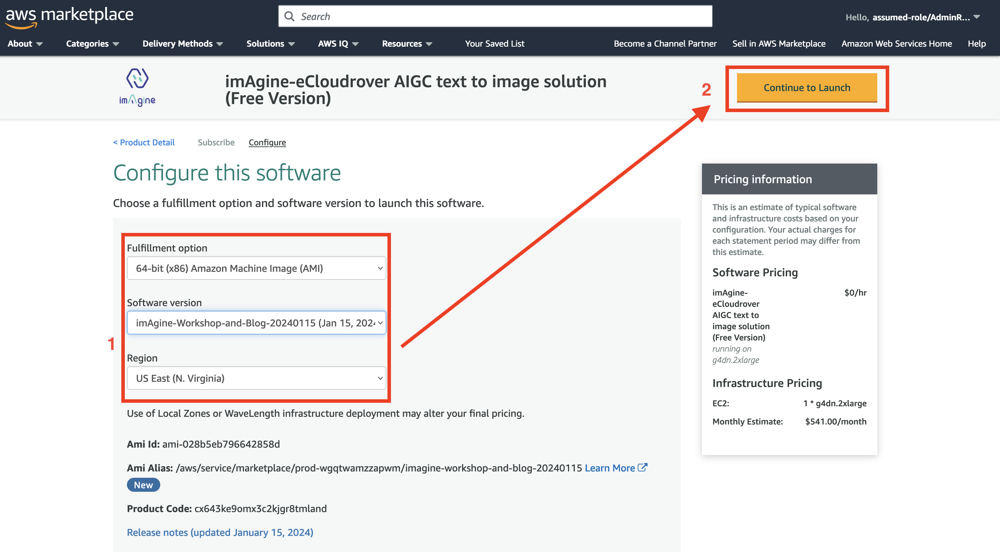

   确认版本与区域选择后，点击 “Continue to Launch” 进入启动 EC2 服务器的设置界面。

5. 在启动方式界面，请选择通过 EC2 启动，随后您将跳转到 EC2 控制台以完成 imAgine 解决方案的部署。
   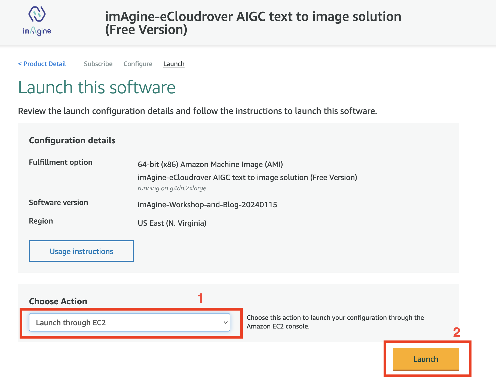

6. 在启动实例界面，首先填写服务器名称，例如 sd-workshop。同时请在此处检查 AMI 版本，确保是从 imAgine-Workshop 版本启动。
   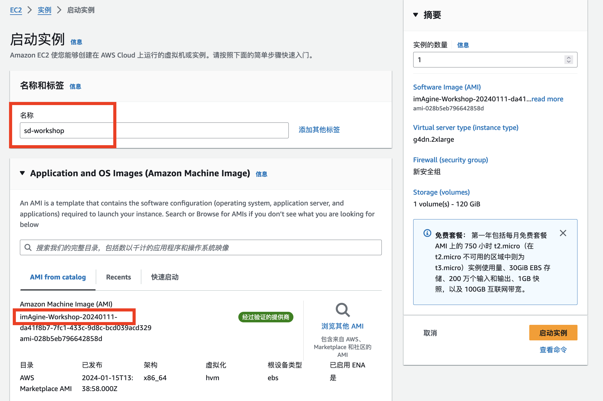

   **选择 EC2 实例类型**：此处我们建议选择 g4dn.2xlarge 或 g5.2xlarge，分别拥有 16G 显存和 24G 显存的 GPU。
   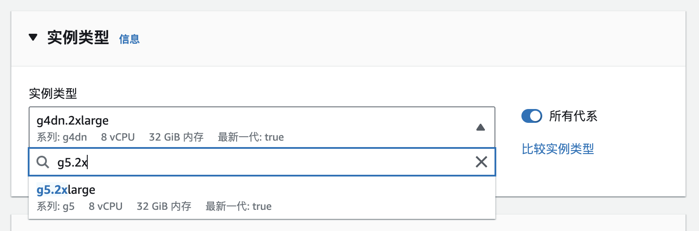

   **密钥对**：如果您需要使用本地 SSH 工具连接进服务器，则需要在此处创建新密钥并指定，同时需要注意安全组开放 22 端口；**如果对 SSH 并不熟悉，请选择 “在没有密钥对的情况下继续”**。
   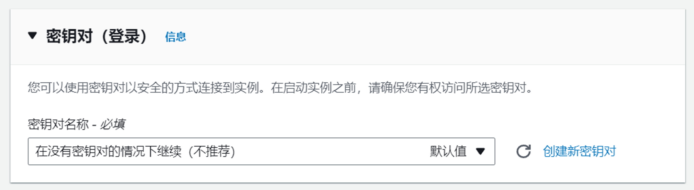

   **网络配置**：因为 imAgine 中部署的 Stable Diffusion Webui 是一个面向公网提供的 Web 服务，请选择一个**公有子网**来启动服务器，并允许来自互联网的流量访问 80 端口，同时**确保此处 “自动分配公有 IP” 保持启用状态**。

   解决方案将帮助您创建安全组及规则，将允许所有来自互联网的流量访问 80 端口以保证 Webui 页面可以被正常访问，默认将在 Default VPC 的公有子网中启动实例。您可以保持默认网络配置。
   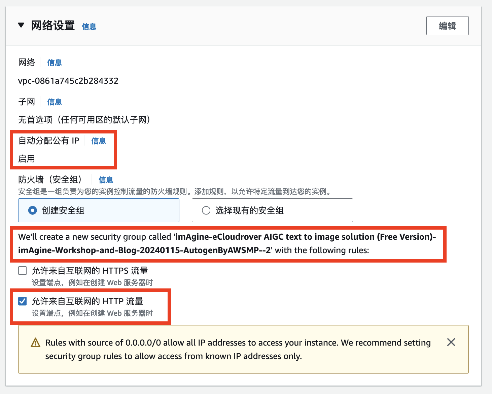

   **存储配置**: 存储默认将使用 120GB，用于存储模型相关文件。您可以保持默认存储配置。
   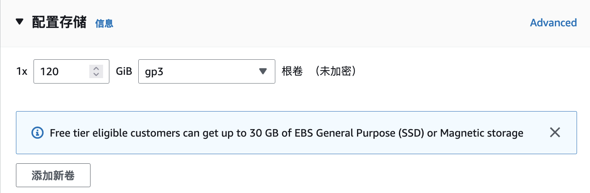

7. 配置完成后请点击右下角“启动实例”按钮，启动对应实例。  
   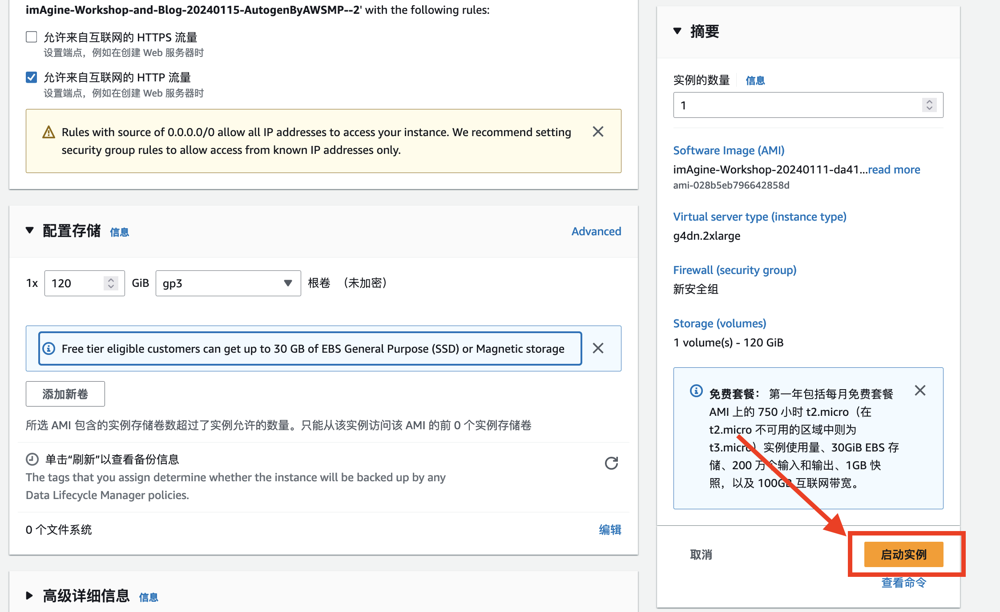

8. 您可以点击实例 ID 查看启动状态。当实例状态成为“正在运行”以及“状态检查”通过，则实例成功启动。
   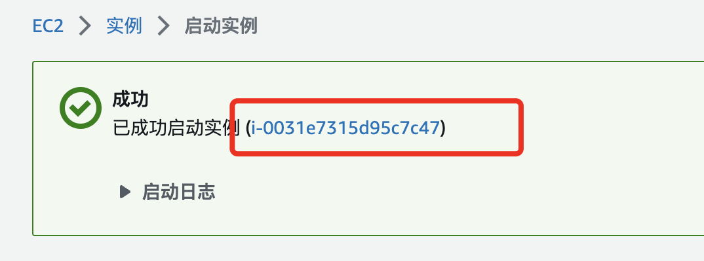

9. 服务器正常启动后，即可在 EC2 控制台界面找到，选中该服务器，复制服务器的公有 IPv4 地址
   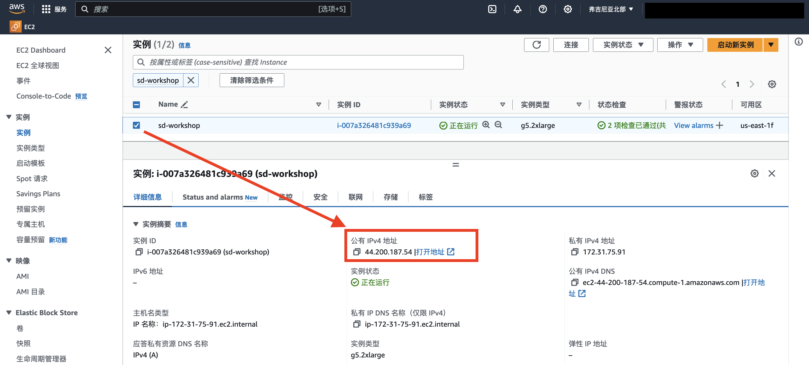

10. 在浏览器地址栏输入 http://实例公有 IP 地址。服务器的公有 IPv4 地址为您在上一步所复制的地址。

    如下图，您会在浏览器上看到登录提示框，用户名为固定的 webui，密码则为该 EC2 服务器的实例 ID，可以在 EC2 控制台找到。

    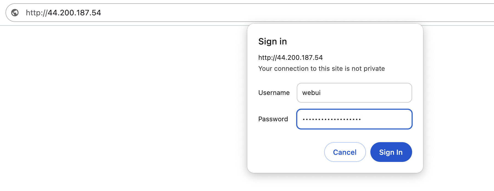
    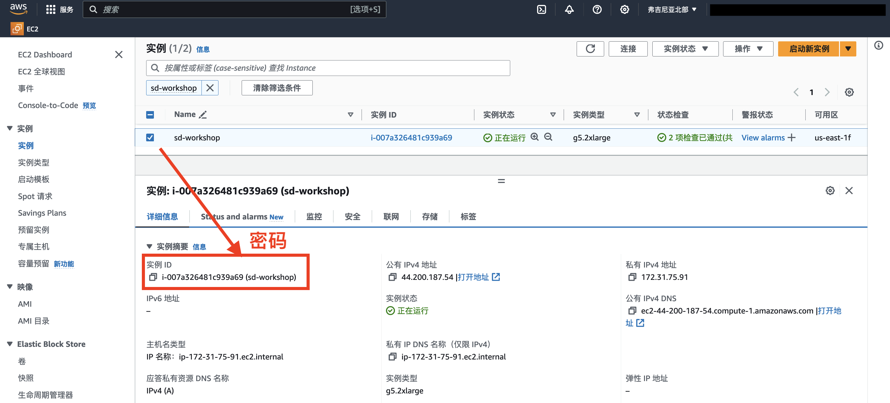

11. 填写完成后点击 “登录”，即可进入 Stable Diffusion Webui 界面，您将在此处开始尽情施展艺术创意。
    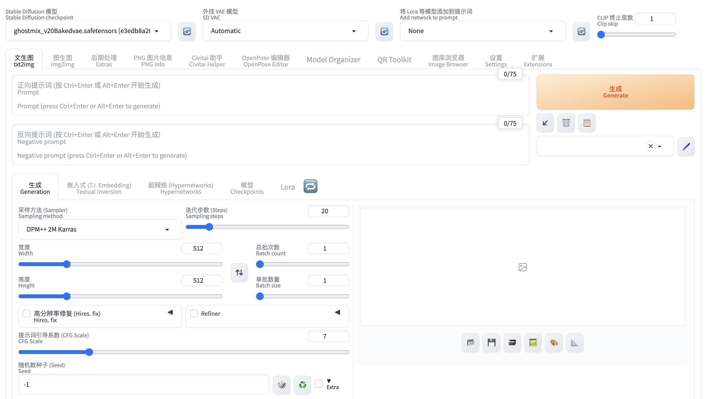

12. 如果访问服务器时出现以下网页内容，请稍等。初次从 Marketplace 订阅的 AMI 运行 imAgine 绘画服务，通常需要等待 10-15 分钟，以完成服务依赖和模型的加载。
    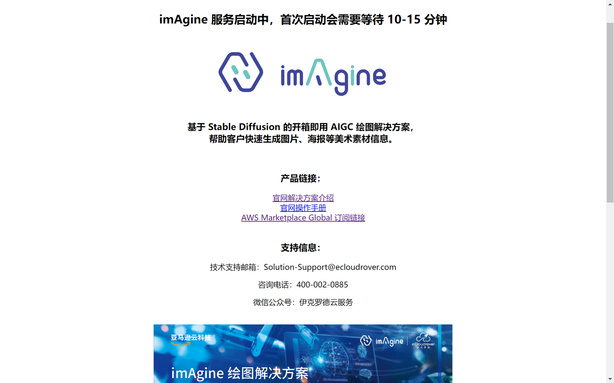
