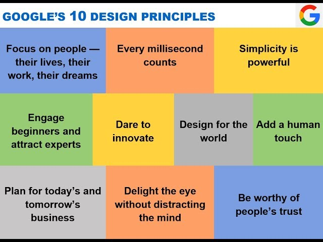
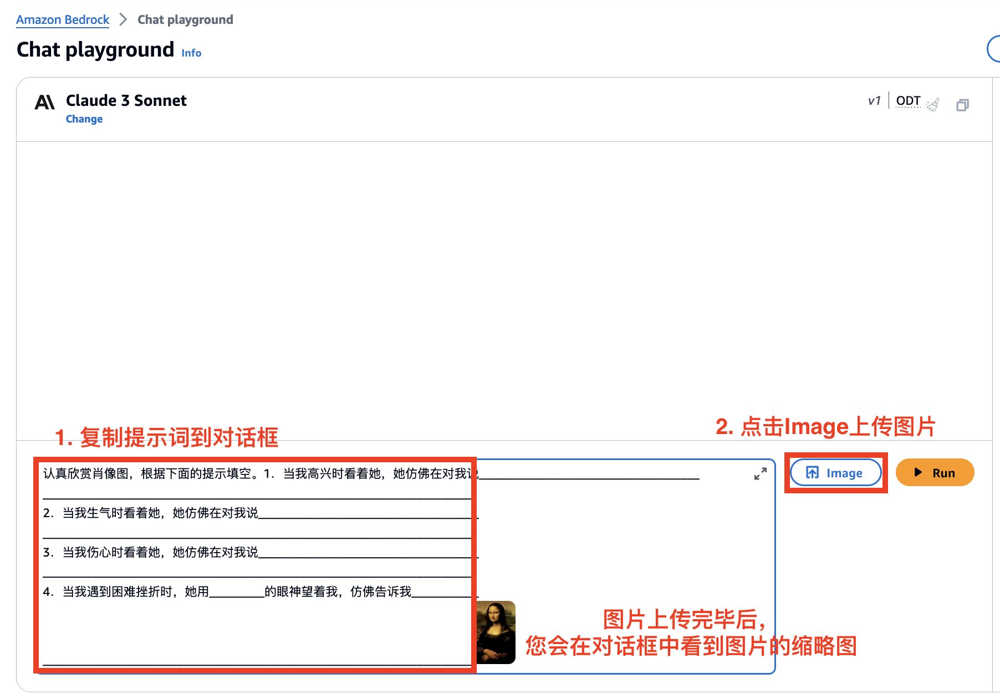
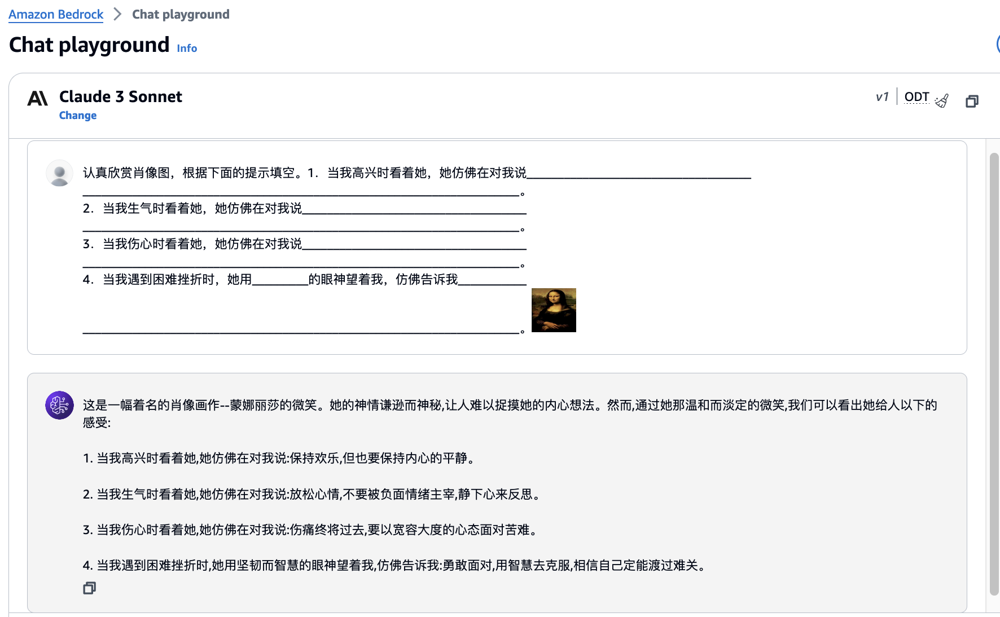
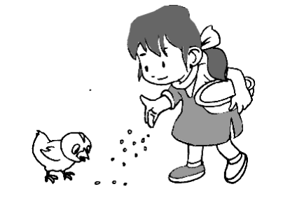
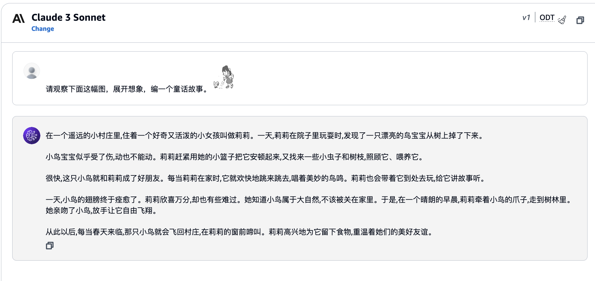
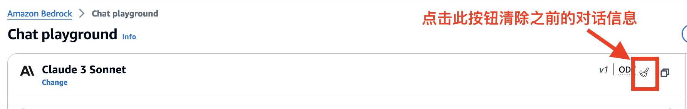

# 看图写话

在本次实验中，您将体验 Claude3 的多模态能力。

多模态大模型能够同时处理不同形式的输入，如文本、图像等，并生成相应的输出。这种能力使其在各种场景下都有广泛的应用前景，如视觉问答、图像描述、内容审核等。

## 前置需求

1. 请确保您已配置好 Claude3 模型的访问权限并登录到 Bedrock [模型聊天界面](https://us-east-1.console.aws.amazon.com/bedrock/home?region=us-east-1#/chat-playground)，具体步骤可参考[01\_配置 Bedrock 模型访问权限](../01_前置需求/01_配置Bedrock模型访问权限.md)

2. 浏览/尝试给定的[示例](#示例)

## 任务说明

1. 将下列 Amazon 和 Google 的领导力准则图片一起喂给 Claude3，发挥您的想象，自定义提示词，让模型以不同的方式解读这两种领导力准则(可参考[示例二](#示例二))。您可以选择 Claude 3 Sonnet 或 Claude 3 Haiku 完成本次实验。请选取最好的结果拍一张照片上传到 微信小程序（照片需包含提示词和模型回答）。
   
   

## 示例

<!-- ### 示例一

选择 Claude 3 Sonnet 模型，将下列提示词复制到对话框中，然后点击 Image 上传给定图片，接着点击运行。您也可以根据自己的理解修改提示词。



提示词

```
1．当我高兴时看着她，她仿佛在对我说____________________________________
______________________________________________________________________。
2．当我生气时看着她，她仿佛在对我说____________________________________
______________________________________________________________________。
3．当我伤心时看着她，她仿佛在对我说____________________________________
______________________________________________________________________。
4．当我遇到困难挫折时，她用_________的眼神望着我，仿佛告诉我___________
______________________________________________________________________。
```

图片


结果

 -->

### 示例一

将下列提示词复制到对话框中，然后点击 Image 上传给定图片，接着点击运行。

提示词

```
请观察下面这幅图，展开想象，编一个童话故事。
```

图片



结果



### 示例二

如下图，可点击小刷子按钮清除历史对话信息


提示词

```
参考给定图片，用中文举一个例子说明亚马逊和谷歌在各自领导原则指引下，可能会在同一情况下做出不同的决策。
```

图片见[任务说明](#任务说明)

结果

