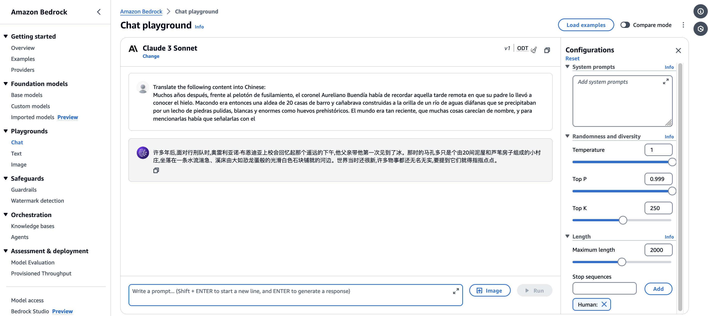
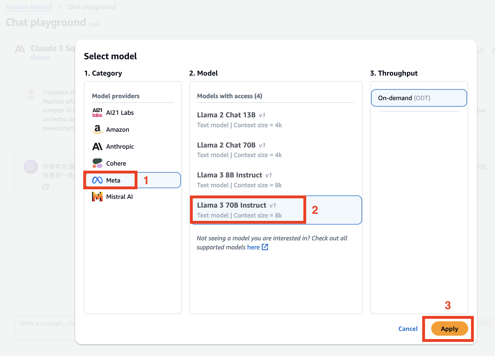
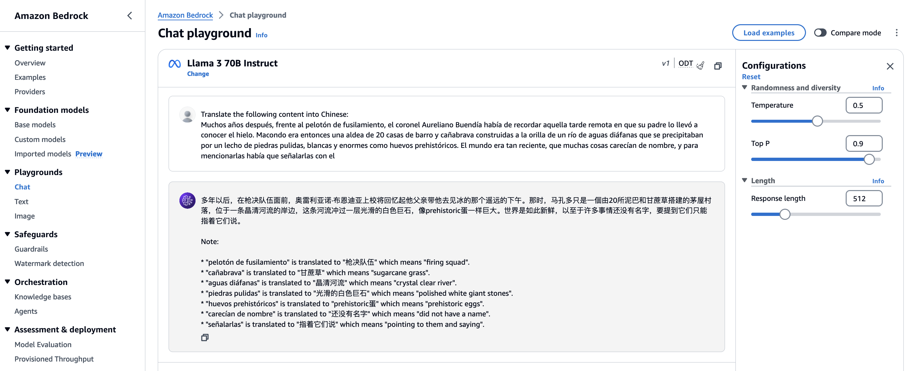
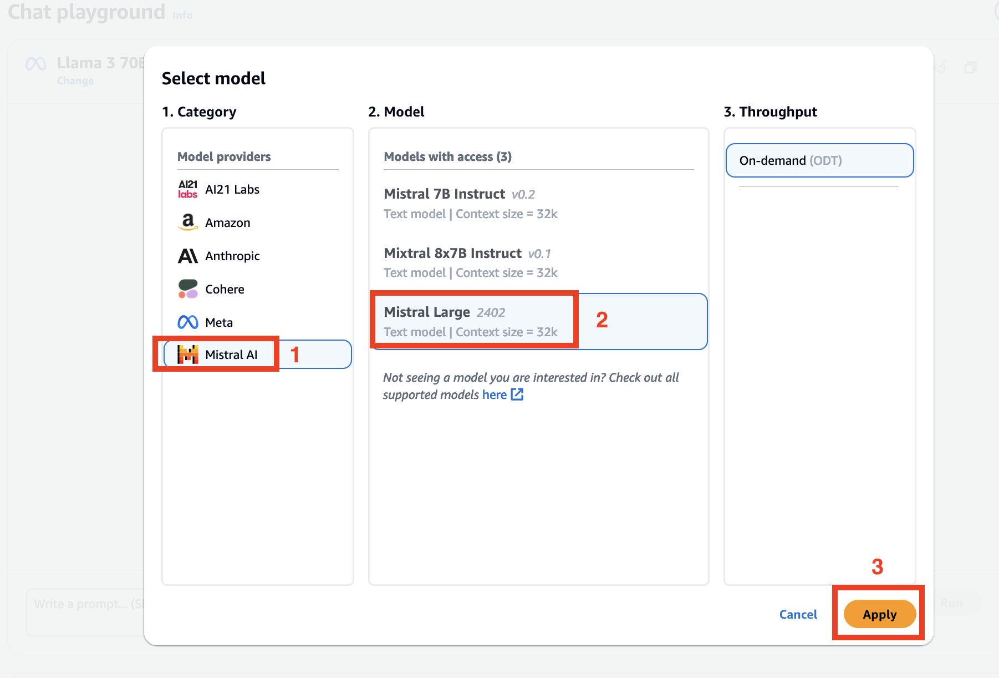
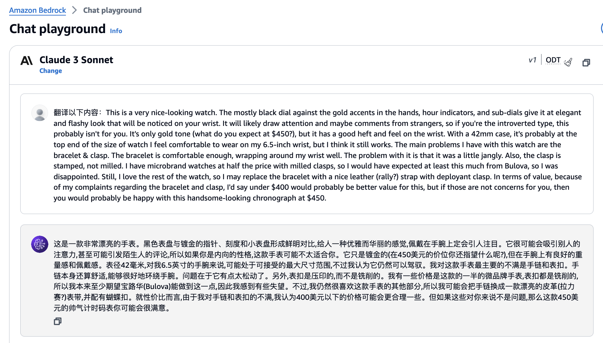
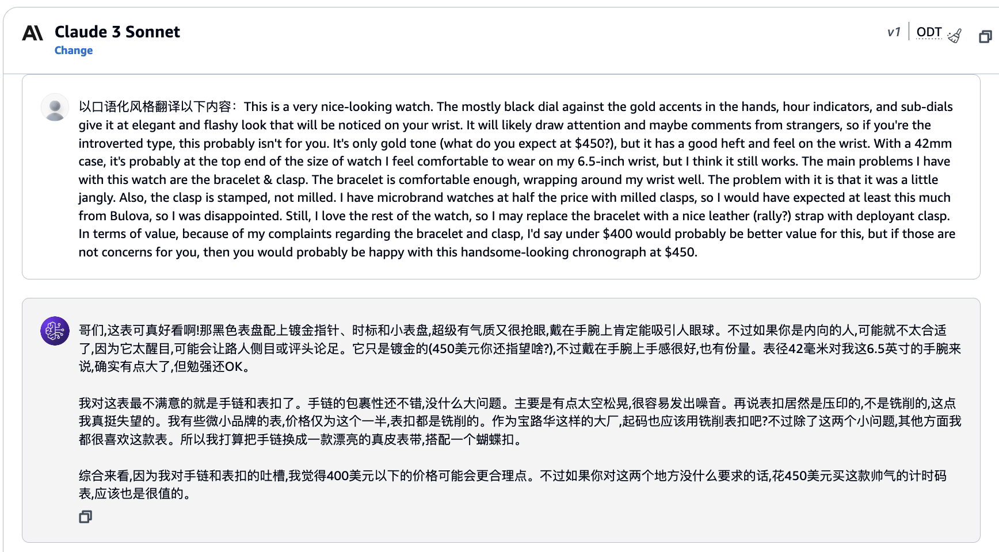
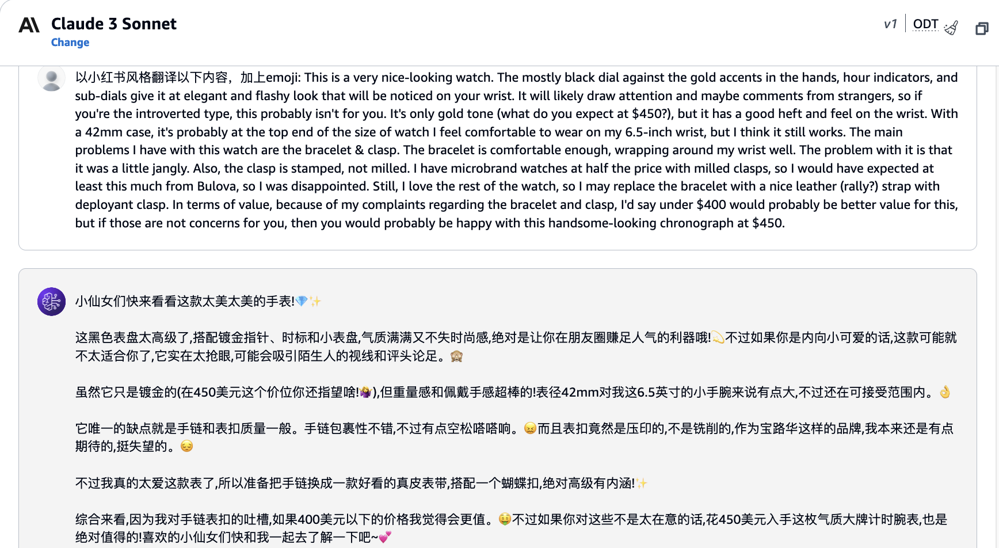

# 翻译

本次动手实验旨在让大家亲身体验大语言模型在翻译领域的强大功能。我们将通过两个生动有趣的场景，引导大家探索不同模型的翻译效果，以及如何将给定内容翻译成不同风格。

第一个场景将对比多个大语言模型（Claude3/Llamma3/Mistral）在翻译任务上的表现，让大家感受不同模型在翻译质量和响应速度上等方面的差异。第二个场景使用 Claude3 将一段内容翻译成不同风格，让大家体会模型在风格迁移方面的能力。

这只是抛砖引玉，我们鼓励大家在实验过程中自由发挥，尝试更多有趣的风格！

## 前置需求

1. 请确保您已配置好所有模型的访问权限并登录到 [Bedrock 模型聊天界面](https://us-east-1.console.aws.amazon.com/bedrock/home?region=us-east-1#/chat-playground)，具体步骤可参考[01\_配置 Bedrock 模型访问权限](../01_前置需求/01_配置Bedrock模型访问权限.md)

2. 浏览/尝试给定的[示例](#示例)

## 任务说明

1. 使用任意风格（例如相声/李白/武侠风格等）翻译如下内容，自定义提示词，您可以选择不同模型（Claude3 Sonnet/Mistral/LLaMA 等）完成任务，请选取最好的结果拍一张照片上传到微信小程序（照片需包含提示词和模型回答）。
   ```
   Если жизнь тебя обманет,
   Не печался,не сердись,
   В день уныния смирись,
   Динь веселья,верь настанет,
   Сердце в будущем живёт,
   Настоящее уныло
   всё мгновено,всё пройдёт
   Что пройдёт,то будет мило！
   ```

<!-- ## 原文

下列段落为名著《百年孤独》的开头，我们将使用不同模型进行翻译。

```
Muchos años después, frente al pelotón de fusilamiento, el coronel Aureliano Buendía había de recordar aquella tarde remota en que su padre lo llevó a conocer el hielo. Macondo era entonces una aldea de 20 casas de barro y cañabrava construidas a la orilla de un río de aguas diáfanas que se precipitaban por un lecho de piedras pulidas, blancas y enormes como huevos prehistóricos. El mundo era tan reciente, que muchas cosas carecían de nombre, y para mencionarlas había que señalarlas con el dedo.
``` -->

## 示例

### 场景一：使用不同模型翻译

#### 1. 使用 Claude 3 Sonnet 翻译

将下列内容复制到和 Claude 3 的对话框中，然后点击运行。您也可以根据自己的理解修改 Prompt。

```
Translate the following content into Chinese:
Muchos años después, frente al pelotón de fusilamiento, el coronel Aureliano Buendía había de recordar aquella tarde remota en que su padre lo llevó a conocer el hielo. Macondo era entonces una aldea de 20 casas de barro y cañabrava construidas a la orilla de un río de aguas diáfanas que se precipitaban por un lecho de piedras pulidas, blancas y enormes como huevos prehistóricos. El mundo era tan reciente, que muchas cosas carecían de nombre, y para mencionarlas había que señalarlas con el dedo.
```

下图为 Claude3 Sonnet 的翻译结果，模型输出有随机性，您可以多次运行或调整参数查看不同输出效果。


#### 2. 使用 Llama3 70B Instruct 翻译

如下图，点击 change 更换模型


请依次选择 Meta -> Llamma 3 70B Instruct -> Apply



将下列内容复制到对话框中，然后点击运行。您也可以根据自己的理解修改 Prompt。

```
Translate the following content into Chinese:
Muchos años después, frente al pelotón de fusilamiento, el coronel Aureliano Buendía había de recordar aquella tarde remota en que su padre lo llevó a conocer el hielo. Macondo era entonces una aldea de 20 casas de barro y cañabrava construidas a la orilla de un río de aguas diáfanas que se precipitaban por un lecho de piedras pulidas, blancas y enormes como huevos prehistóricos. El mundo era tan reciente, que muchas cosas carecían de nombre, y para mencionarlas había que señalarlas con el dedo.
```

下图为 Llama 3 70B Instruct 的翻译结果，模型输出有随机性，您可以多次运行或调整参数查看不同输出效果。



#### 3. 使用 Mistral Large 翻译

如下图，点击 change 更换模型


请依次选择 Mistral AI -> Mistral Large -> Apply



将下列内容复制到对话框中，然后点击运行。您也可以根据自己的理解修改 Prompt。

```
Translate the following content into Chinese:
Muchos años después, frente al pelotón de fusilamiento, el coronel Aureliano Buendía había de recordar aquella tarde remota en que su padre lo llevó a conocer el hielo. Macondo era entonces una aldea de 20 casas de barro y cañabrava construidas a la orilla de un río de aguas diáfanas que se precipitaban por un lecho de piedras pulidas, blancas y enormes como huevos prehistóricos. El mundo era tan reciente, que muchas cosas carecían de nombre, y para mencionarlas había que señalarlas con el dedo.
```

下图为 Mistral Large 的翻译结果，模型输出有随机性，您可以多次运行或调整参数查看不同输出效果。


### 场景二：风格化翻译

下列示例使用 **Claude 3 Sonnet** 对亚马逊电商中的某商品评论进行不同风格的翻译。

产品评论原文

```
This is a very nice-looking watch. The mostly black dial against the gold accents in the hands, hour indicators, and sub-dials give it at elegant and flashy look that will be noticed on your wrist. It will likely draw attention and maybe comments from strangers, so if you're the introverted type, this probably isn't for you. It's only gold tone (what do you expect at $450?), but it has a good heft and feel on the wrist. With a 42mm case, it's probably at the top end of the size of watch I feel comfortable to wear on my 6.5-inch wrist, but I think it still works. The main problems I have with this watch are the bracelet & clasp. The bracelet is comfortable enough, wrapping around my wrist well. The problem with it is that it was a little jangly. Also, the clasp is stamped, not milled. I have microbrand watches at half the price with milled clasps, so I would have expected at least this much from Bulova, so I was disappointed. Still, I love the rest of the watch, so I may replace the bracelet with a nice leather (rally?) strap with deployant clasp. In terms of value, because of my complaints regarding the bracelet and clasp, I'd say under $400 would probably be better value for this, but if those are not concerns for you, then you would probably be happy with this handsome-looking chronograph at $450.
```

#### 1. 直译



#### 2. 口语化风格



#### 2. 小红书风格


