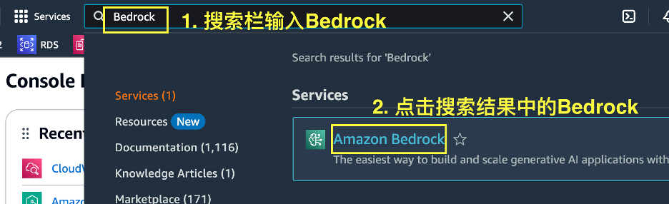
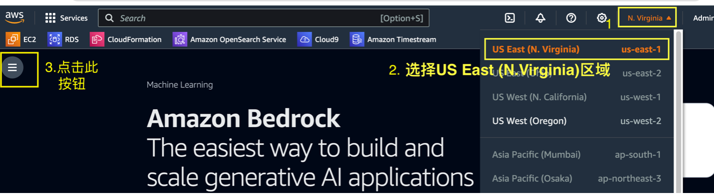
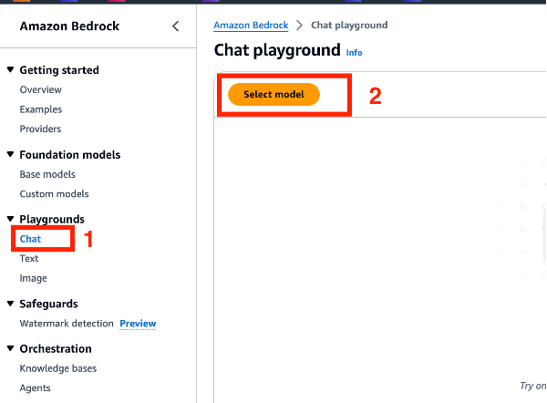
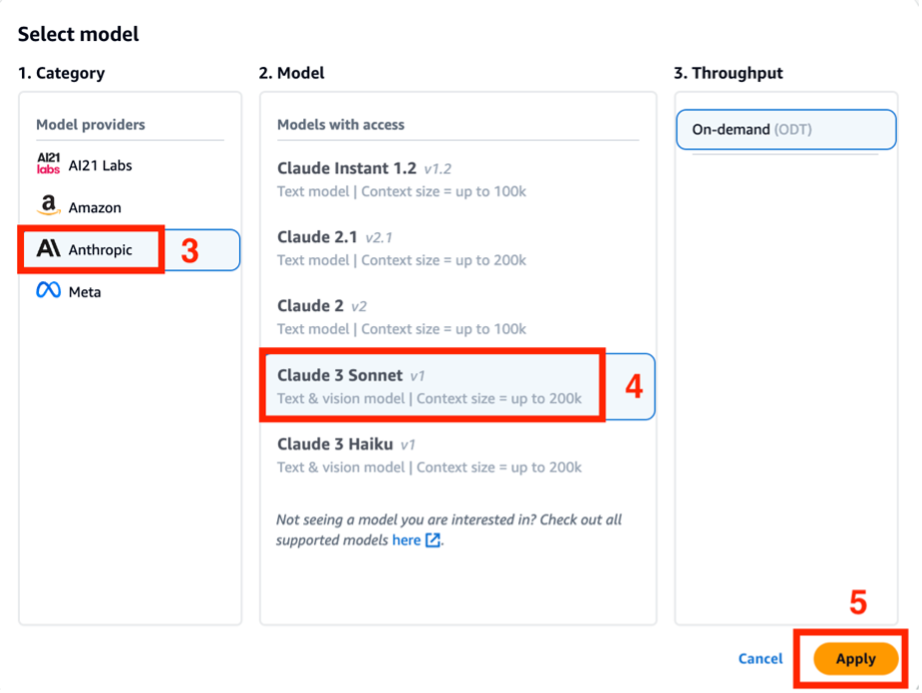

# 翻译

在本次实验中，您将使用 [Amazon Bedrock](https://aws.amazon.com/cn/bedrock/?nc1=h_ls) 中的不同大语言模型进行翻译任务。

本次动手实验旨在让大家亲身体验大语言模型在翻译领域的强大功能。我们将通过两个生动有趣的场景，引导大家探索不同模型的翻译效果，以及如何将给定内容翻译成不同风格。

第一个场景将对比多个大语言模型在翻译任务上的表现，让大家直观感受它们在翻译质量和响应速度上等方面的差异。第二将一段内容翻译成不同风格，让大家体会模型在风格迁移方面的能力。

这只是抛砖引玉，我们鼓励大家在实验过程中自由发挥，尝试更多有趣的应用场景！

## 前置需求

1. 请确保您已按照[01\_配置 Bedrock 模型访问权限](../01_前置需求/01_配置Bedrock模型访问权限.md)配置好所有模型的访问权限。
2. 登录您的 AWS 账号，在 AWS 控制台顶部搜索栏搜索 Bedrock，在搜索结果中点击 Bedrock
   

3. 在右上角选择区域，请选择 US East (N.Virginia)，然后点击左侧 Bedrock 配置按钮，如下图所示

   

4. 使用大语言模型，如下图所示

- 点击左侧导航栏的 Playgrounds -> Chat
- 在 Chat playground 点击 Select model
- 选择 模型供应商，例如 Anthropic
- 选择 你想要使用的模型，例如 Claude 3 Sonent
- 点击 Apply
- 之后您可以在对话框输入任何文字来和 Claude3 交流
  
  

<!-- ## 原文

下列段落为名著《百年孤独》的开头，我们将使用不同模型进行翻译。

```
Muchos años después, frente al pelotón de fusilamiento, el coronel Aureliano Buendía había de recordar aquella tarde remota en que su padre lo llevó a conocer el hielo. Macondo era entonces una aldea de 20 casas de barro y cañabrava construidas a la orilla de un río de aguas diáfanas que se precipitaban por un lecho de piedras pulidas, blancas y enormes como huevos prehistóricos. El mundo era tan reciente, que muchas cosas carecían de nombre, y para mencionarlas había que señalarlas con el dedo.
``` -->

## 场景一：使用不同模型翻译

### 1. 使用 Claude3 Sonnet 翻译

按照[前置需求](#前置需求)选择好模型后，将下列内容复制到对话框中，然后点击运行。您也可以根据自己的理解修改 Prompt。

```
Translate the following content into Chinese:
Muchos años después, frente al pelotón de fusilamiento, el coronel Aureliano Buendía había de recordar aquella tarde remota en que su padre lo llevó a conocer el hielo. Macondo era entonces una aldea de 20 casas de barro y cañabrava construidas a la orilla de un río de aguas diáfanas que se precipitaban por un lecho de piedras pulidas, blancas y enormes como huevos prehistóricos. El mundo era tan reciente, que muchas cosas carecían de nombre, y para mencionarlas había que señalarlas con el dedo.
```

下图为 Claude3 Sonnet 的翻译结果，模型输出有随机性，您可以多次运行或调整参数查看不同输出效果。


### 2. 使用 Llama3 70B Instruct 翻译

如下图，点击 change 更换模型


请依次选择 Meta -> Llamma 3 70B Instruct -> Apply


将下列内容复制到对话框中，然后点击运行。您也可以根据自己的理解修改 Prompt。

```
Translate the following content into Chinese:
Muchos años después, frente al pelotón de fusilamiento, el coronel Aureliano Buendía había de recordar aquella tarde remota en que su padre lo llevó a conocer el hielo. Macondo era entonces una aldea de 20 casas de barro y cañabrava construidas a la orilla de un río de aguas diáfanas que se precipitaban por un lecho de piedras pulidas, blancas y enormes como huevos prehistóricos. El mundo era tan reciente, que muchas cosas carecían de nombre, y para mencionarlas había que señalarlas con el dedo.
```

下图为 Llama 3 70B Instruct 的翻译结果，模型输出有随机性，您可以多次运行或调整参数查看不同输出效果。


### 3. 使用 Mistral Large 翻译

如下图，点击 change 更换模型


请依次选择 Mistral AI -> Mistral Large -> Apply


将下列内容复制到对话框中，然后点击运行。您也可以根据自己的理解修改 Prompt。

```
Translate the following content into Chinese:
Muchos años después, frente al pelotón de fusilamiento, el coronel Aureliano Buendía había de recordar aquella tarde remota en que su padre lo llevó a conocer el hielo. Macondo era entonces una aldea de 20 casas de barro y cañabrava construidas a la orilla de un río de aguas diáfanas que se precipitaban por un lecho de piedras pulidas, blancas y enormes como huevos prehistóricos. El mundo era tan reciente, que muchas cosas carecían de nombre, y para mencionarlas había que señalarlas con el dedo.
```

下图为 Mistral Large 的翻译结果，模型输出有随机性，您可以多次运行或调整参数查看不同输出效果。


## 场景二：风格化翻译

下列示例使用 **Claude3 Sonnet** 对亚马逊电商中的某商品评论进行不同风格的翻译。

产品评论原文

```
This is a very nice-looking watch. The mostly black dial against the gold accents in the hands, hour indicators, and sub-dials give it at elegant and flashy look that will be noticed on your wrist. It will likely draw attention and maybe comments from strangers, so if you're the introverted type, this probably isn't for you. It's only gold tone (what do you expect at $450?), but it has a good heft and feel on the wrist. With a 42mm case, it's probably at the top end of the size of watch I feel comfortable to wear on my 6.5-inch wrist, but I think it still works. The main problems I have with this watch are the bracelet & clasp. The bracelet is comfortable enough, wrapping around my wrist well. The problem with it is that it was a little jangly. Also, the clasp is stamped, not milled. I have microbrand watches at half the price with milled clasps, so I would have expected at least this much from Bulova, so I was disappointed. Still, I love the rest of the watch, so I may replace the bracelet with a nice leather (rally?) strap with deployant clasp. In terms of value, because of my complaints regarding the bracelet and clasp, I'd say under $400 would probably be better value for this, but if those are not concerns for you, then you would probably be happy with this handsome-looking chronograph at $450.
```

### 1. 直译


### 2. 口语化风格


### 2. 小红书风格


