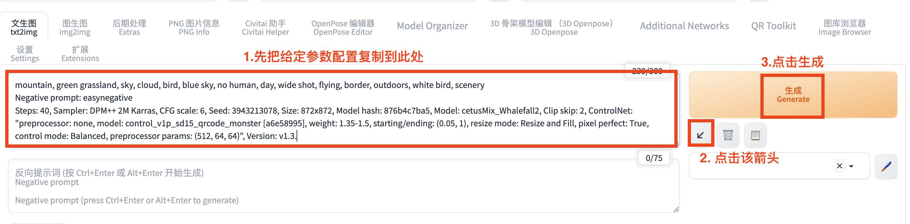
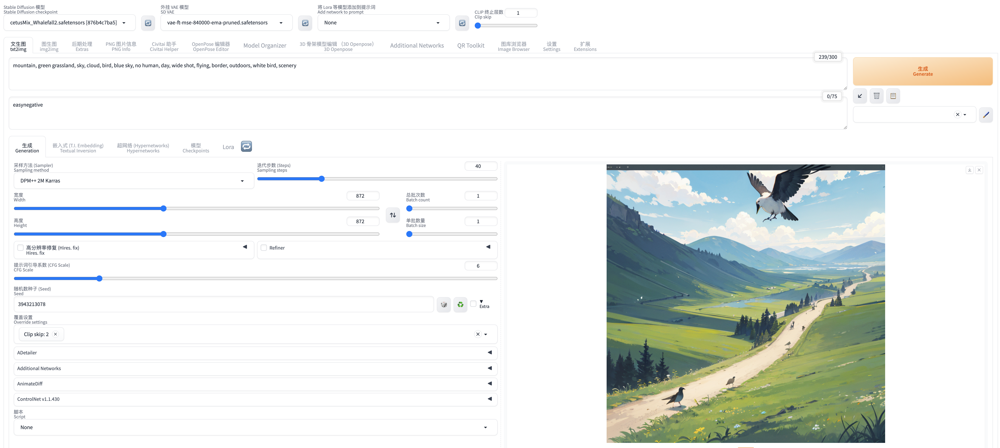
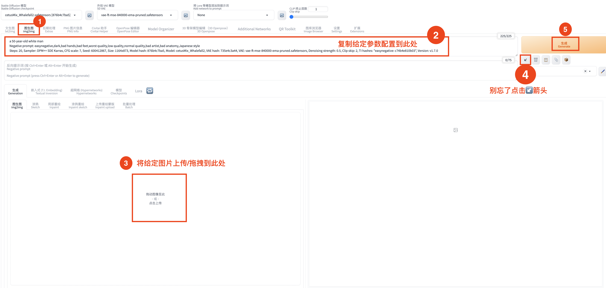
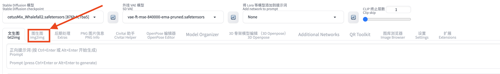

# 体验 SD Web UI 生成图片

Stable Diffusion 是一种基于扩散模型的生成式 AI 模型，它能够根据文本描述生成高质量的图像。借助 Web UI，我们可以方便地与模型进行交互，输入自定义的文本提示，并实时查看生成的图像结果。

通过这个实验，大家将亲身体验生成式 AI 在视觉创作领域的巨大潜力。

## 前置需求

1. 请确保您已完成[02\_申请 G 系列实例限额](../01_前置需求/02_申请G系列实例限额.md)和[03\_订阅和部署 ECR 文生图解决方案](../01_前置需求/03_订阅和部署ECR文生图解决方案.md)所有步骤。

2. 如何登录到 webui 界面：请参考[03\_订阅和部署 ECR 文生图解决方案](../01_前置需求/03_订阅和部署ECR文生图解决方案.md)的第 9-12 步。

## 任务说明

1. 浏览/尝试给定的[示例](#示例)
2. 上传任意图片到 SD Web UI，自定义提示词，完成图片到图片的生成任务（图生图操作步骤可参考示例二），请将**原图与生成的图片拍照上传**到微信小程序。

## 示例

### 一、文生图

```
mountain, green grassland, sky, cloud, bird, blue sky, no human, day, wide shot, flying, border, outdoors, white bird, scenery
Negative prompt: easynegative
Steps: 40, Sampler: DPM++ 2M Karras, CFG scale: 6, Seed: 3943213078, Size: 872x872, Model hash: 876b4c7ba5, Model: cetusMix_Whalefall2, Clip skip: 2, ControlNet: "preprocessor: none, model: control_v1p_sd15_qrcode_monster [a6e58995], weight: 1.35-1.5, starting/ending: (0.05, 1), resize mode: Resize and Fill, pixel perfect: True, control mode: Balanced, preprocessor params: (512, 64, 64)", Version: v1.3.

```

1. 如下图，首先将上述参数复制到 Web UI 的**正向提示词文本框**中
2. 点击下图所示的箭头，Web UI 可自动识别并加载参数到相应配置。
3. 点击生成

   

4. 生成的图片

   

### 二、图生图



1. 如上图，首先点击图生图(img2img)选项卡

   <!--  -->

2. 将下列参数复制到 Web UI 的**正向提示词文本框**中

   ```
   a 50-year-old white man
   Negative prompt: easynegative,dark,bad hands,bad feet,worst quality,low quality,normal quality,bad artist,bad anatomy,Japanese style
   Steps: 20, Sampler: DPM++ SDE Karras, CFG scale: 7, Seed: 600412867, Size: 1164x873, Model hash: 876b4c7ba5, Model: cetusMix_Whalefall2, VAE hash: 735e4c3a44, VAE: vae-ft-mse-840000-ema-pruned.safetensors, Denoising strength: 0.5, Clip skip: 2, TI hashes: "easynegative: c74b4e810b03", Version: v1.7.0
   ```

3. 将下图保存到本地，然后上传到 webui 指定位置（见上图标注）

   

4. 点击图示箭头，Web UI 可自动识别并加载参数到相应配置。
5. 点击生成
6. 生成的图片

   
